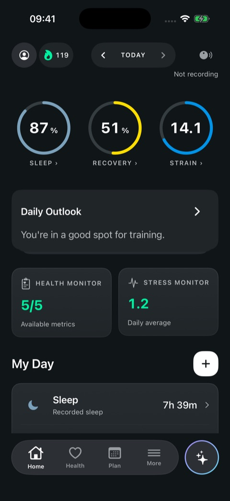
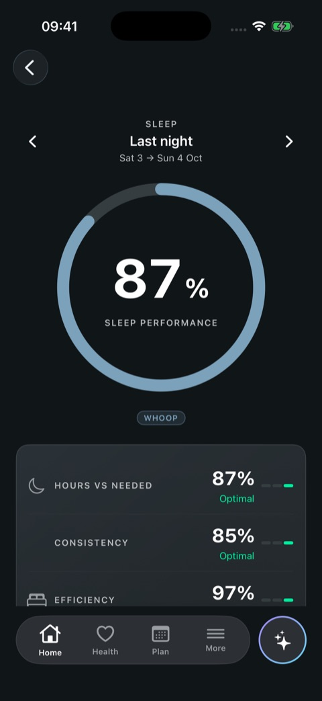
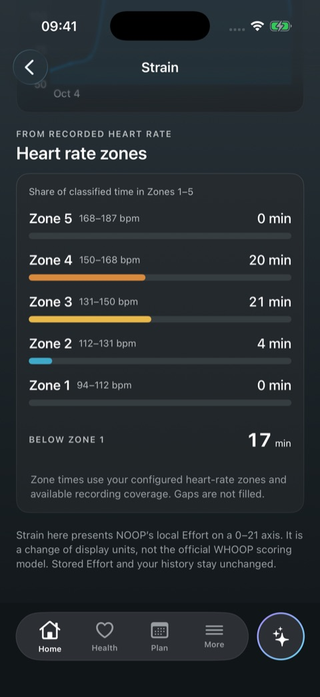
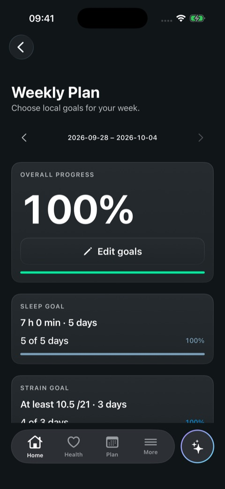
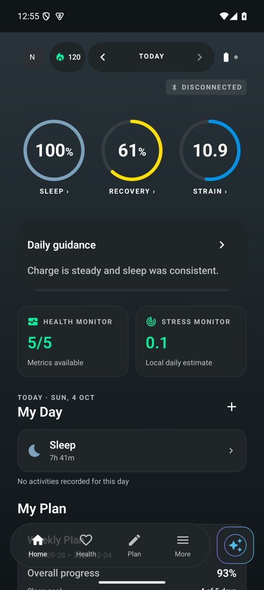
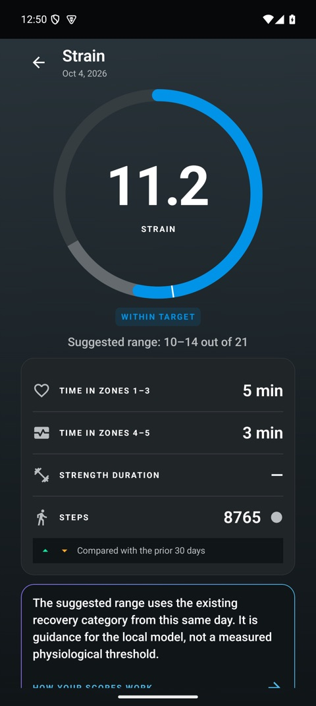

<p align="center">
  
</p>

<h1 align="center">troop</h1>

<p align="center"><b>A personal-use fork of <a href="https://github.com/ryanbr/noop">NOOP</a> with a WHOOP-style interface.<br>Your strap. Your data. Your phone. Offline, on-device, no cloud.</b></p>

<p align="center">
  
  
  
  
  <a href="LICENSE"></a>
</p>

<p align="center">
  <a href="#install">⬇&nbsp;Install</a> ·
  <a href="#what-is-different-from-noop">What's different</a> ·
  <a href="#status">Status</a> ·
  <a href="#build-from-source">Build</a> ·
  <a href="https://github.com/ryanbr/noop">Upstream NOOP</a>
</p>

<p align="center">
  
  &nbsp;
  
  &nbsp;
  
</p>
<p align="center">
  
  &nbsp;
  
  &nbsp;
  
</p>
<p align="center"><sub>Simulator / emulator captures with synthetic demo data.</sub></p>

---

## What this is

**troop** is a fork of [ryanbr/noop](https://github.com/ryanbr/noop) maintained for **personal use**.
It keeps everything NOOP is — Bluetooth pairing with your own WHOOP 4.0 / 5.0 strap, on-device SQLite,
recovery / strain / HRV / sleep computed locally, no account, no server, no telemetry — and reshapes
the app to look and flow like the official WHOOP app.

It is not a product, has no releases promised, and is not affiliated with WHOOP or with the NOOP
maintainers. For the real project, community and support, go to
[github.com/ryanbr/noop](https://github.com/ryanbr/noop).

## What is different from NOOP

| Area | In troop |
|---|---|
| **Shell** | WHOOP-style 4 tabs — **Home · Health · Plan · More** — with the Coach as a floating sheet; dark theme by default. See [WHOOP_UI.md](docs/WHOOP_UI.md). |
| **Home** | Sleep / Recovery / Strain dials, day stepping, daily guidance, Health Monitor and Stress tiles, My Day, plan summary, start an activity from Home, hide / reorder the dashboard. |
| **Recovery & Strain** | Per-day detail screens, activity detail with "edit" / "edit a copy", Strain shown on a 0–21 axis (a lossless display mapping of local Effort — not WHOOP's model). See [RECOVERY_STRAIN_DETAILS.md](docs/RECOVERY_STRAIN_DETAILS.md). |
| **Sleep** | Sleep detail with stages, window heart rate, naps and history; **Sleep Planner** with sleep goals, wind-down and strap alarm. See [SLEEP_PLANNER.md](docs/SLEEP_PLANNER.md). |
| **Health** | 5-row **Health Monitor** (green / amber / red), Health Report PDF (30 / 180 days), illness / outlier alerts, local **Healthspan**, **Stress Monitor**, VO₂ Max and Steps cards. See [HEALTHSPAN_STRESS.md](docs/HEALTHSPAN_STRESS.md). |
| **Plan** | Journal, Behavior Insights, **Weekly Plan**, Trends (week / month / 6 months), Monthly Performance. See [WHOOP_PLAN.md](docs/WHOOP_PLAN.md). |
| **More & notifications** | WHOOP-style More / Settings; local notifications (Coach brief, Weekly Plan, battery) that open the right screen. See [LOCAL_NOTIFICATIONS.md](docs/LOCAL_NOTIFICATIONS.md). |
| **Firmware** | Shows the strap's firmware version with guidance. The update flow exists **only as a simulation** tested with mocks — it never flashes a real strap. See [FIRMWARE.md](docs/FIRMWARE.md). |
| **Install** | Separate app identity (`com.trapstarks.troop` on Android) so it installs beside upstream NOOP; SideStore / signed-APK instructions. See [INSTALL.md](docs/INSTALL.md). |

Plus a batch of quality-of-life and bug fixes picked from NOOP's open issues and PRs.

## Status

Honest state of this fork:

- ✅ **Built and tested in software**: Swift package tests, the macOS `StrandTests` suite, Android JVM
  unit tests and an iOS compile pass; every screen above was QA'd on the iOS Simulator and Android
  Emulator against WHOOP reference screens.
- ⚠️ **Not yet validated on a real strap or a real phone.** Bluetooth sync, the haptic alarm and
  Apple Health writes have only run against synthetic data. Treat the first install as a test.
- ❌ **Not implemented** (need a server, an account or medical claims): Community / teams, ECG,
  Blood Pressure, Menstrual Cycle, Advanced Labs, Strength Trainer, Strava-style cloud integrations.

## Install

There are no published releases yet — build from source (below), then follow [INSTALL.md](docs/INSTALL.md):

- **iPhone (recommended): SideStore** with a free Apple Account. Free provisioning expires every
  7 days, so refresh in SideStore before then. Alternatives: Xcode with a Personal Team, AltStore,
  Sideloadly.
- **Android: the signed `Full` APK** (Android 8+), optionally tracked with Obtainium. Installs
  beside upstream NOOP; move data across with a `.noopbak` export / import.

> Export a `.noopbak` backup before removing or replacing any installed build — uninstalling deletes
> its local data.

## Build from source

```bash
# Swift packages (no Xcode project, no strap)
cd Packages/WhoopProtocol && swift test

# iOS / macOS (Xcode on macOS; the project is generated from project.yml)
brew install xcodegen && xcodegen generate
open Strand.xcodeproj        # scheme NOOPiOS (iPhone) or Strand (Mac)

# Android (JDK 17, Android SDK 34)
cd android && ./gradlew assembleFullDebug      # real app
cd android && ./gradlew assembleDemoDebug      # synthetic data, no strap needed
```

Details: [BUILD.md](docs/BUILD.md), [IOS.md](docs/IOS.md). Contributor rules inherited from NOOP
(BLE safety contract, Swift/Kotlin parity) are in [AGENTS.md](AGENTS.md).

## Credits

All the hard parts — the BLE protocol work, storage, analytics and the apps themselves — come from
**[NOOP](https://github.com/ryanbr/noop)** and its contributors. NOOP in turn builds on
[`johnmiddleton12/my-whoop`](https://github.com/johnmiddleton12/my-whoop),
[`b-nnett/goose`](https://github.com/b-nnett/goose), GRDB.swift and ZIPFoundation. See
[ATTRIBUTION.md](ATTRIBUTION.md).

troop contains **no WHOOP proprietary code, firmware, logos or assets**; every icon and chart is
recreated. "WHOOP" is used only to identify the hardware and the app whose layout is imitated.

## Disclaimer

Independent, unofficial, non-commercial. **Not affiliated with, endorsed by, or connected to
WHOOP, Inc. or the NOOP project.** Not a medical device: every metric is a local approximation, not
medical advice. Provided as-is, with no warranty — see [DISCLAIMER.md](DISCLAIMER.md).

## License

[PolyForm Noncommercial 1.0.0](LICENSE), inherited from NOOP — personal and non-commercial use only.
Keep the `LICENSE` and `Copyright 2026 NoopApp` notice intact.
